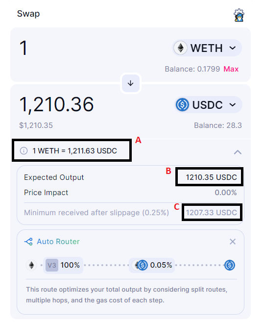
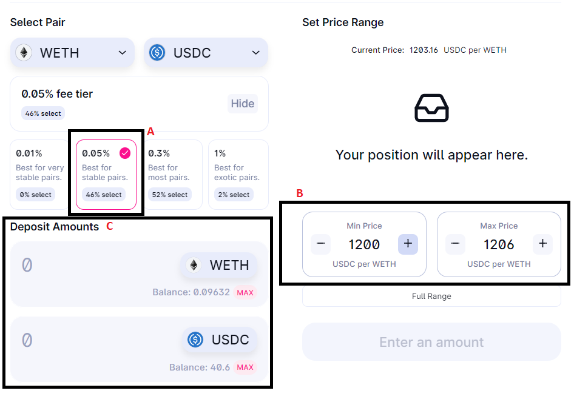
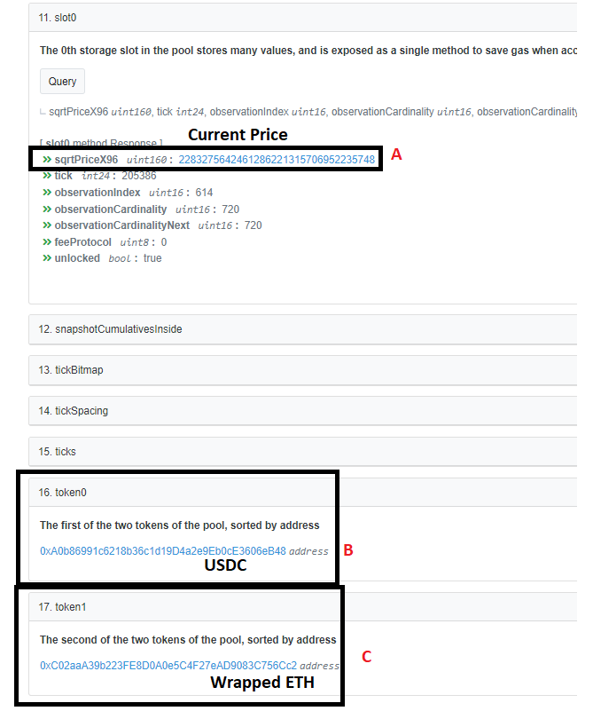

# Intro

This is an exhaustive review of the historical divergent loss (DL) of the ETH-USDC 0.05% Uniswap v3 pool.
As of a block height of 15,576,600 (September 20, 2022) it reviews *all* changes in liquidity, trades in the pool, and accumulated fees to identify the profit and loss of every unique position. 

# Data Collection 

The `collect_data.R` script included in this repo uses the Flipside Crypto's shroomDK API to pull all the relevant data. For brevity, this markdown reads from a saved RDS copy *not* available in the repo. To reproduce this analysis, you can run the `collect_data.R` script using your own shroomDK API key available for free. The script is duplicated but not run here.

```{r, eval = FALSE}
library(shroomDK)

# duplication of collect_data.R

lp_actions <- auto_paginate_query(
  query = "
  SELECT 
  BLOCK_NUMBER, BLOCK_TIMESTAMP,
  TX_HASH, ACTION,
  NF_TOKEN_ID,
   AMOUNT0_ADJUSTED, AMOUNT1_ADJUSTED,
  LIQUIDITY,
  TOKEN0_SYMBOL, TOKEN1_SYMBOL,
  TICK_LOWER, TICK_UPPER,
  PRICE_LOWER_0_1, PRICE_UPPER_0_1,
  LIQUIDITY_PROVIDER,
  NF_POSITION_MANAGER_ADDRESS
  FROM ethereum.uniswapv3.ez_lp_actions
                    WHERE POOL_ADDRESS = '0x88e6a0c2ddd26feeb64f039a2c41296fcb3f5640' AND 
                    BLOCK_NUMBER <= 15576600
                    ORDER BY BLOCK_NUMBER DESC
  ",
  api_key = readLines("api_key.txt")
)

fees <- auto_paginate_query(
  query = "
  SELECT
  BLOCK_NUMBER, BLOCK_TIMESTAMP,
  TX_HASH, NF_TOKEN_ID, 
  AMOUNT0_ADJUSTED, AMOUNT1_ADJUSTED,
  TICK_LOWER, TICK_UPPER,
  PRICE_LOWER, PRICE_UPPER,
  LIQUIDITY_PROVIDER,
  NF_POSITION_MANAGER_ADDRESS
  FROM ethereum.uniswapv3.ez_position_collected_fees
                    WHERE POOL_ADDRESS = '0x88e6a0c2ddd26feeb64f039a2c41296fcb3f5640' AND 
                    BLOCK_NUMBER <= 15576600
                    ORDER BY BLOCK_NUMBER DESC
  ",
  api_key = readLines("api_key.txt")
)


swap_spreads <- c(12370000, 13370000, 14370000, 14870000, 15370000, 15576600)
swaps <- list()
for(i in 1:5){
  swap_query <- "
  SELECT
  BLOCK_NUMBER, BLOCK_TIMESTAMP,
  TX_HASH,
  TICK, AMOUNT0_ADJUSTED, AMOUNT1_ADJUSTED,
  PRICE_1_0, PRICE_0_1
  FROM     ethereum.uniswapv3.ez_swaps
                    WHERE POOL_ADDRESS = '0x88e6a0c2ddd26feeb64f039a2c41296fcb3f5640' AND 
                    BLOCK_NUMBER > min_block
                    AND 
                    BLOCK_NUMBER <= max_block
                    ORDER BY BLOCK_NUMBER DESC
  "
  swap_query <- gsub("min_block", swap_spreads[i], swap_query)
  swap_query <- gsub("max_block", swap_spreads[i+1], swap_query)

  swaps[[i]] <- auto_paginate_query(
  query = swap_query,
  api_key = readLines("api_key.txt")
)
}

all_swaps <- do.call(rbind, swaps)

# Historical ETH prices at all LP_ACTIONS blocks

min_block = min(lp_actions$BLOCK_NUMBER) - 101

blocks = c(min_block, min_block + 1e6, 
           min_block + 2e6, min_block + 3e6, 
           min_block + 4e6)

eth_price <- list()
for(i in 1:length(blocks)){
eth_price[[i]]  <- get_eth_price(min_block = blocks[i],
                                 max_block = blocks[i] + 1e6, 
                                 api_key = readLines('api_key.txt'))
  
}

all_eth_prices <- do.call(rbind, eth_price)

# R Save Format 
saveRDS(lp_actions, "lp_actions.rds")
saveRDS(fees, "fees.rds")
saveRDS(all_swaps, "all_swaps.rds")
saveRDS(unique(all_eth_prices), "eth_prices.rds")


```

```{r, message = FALSE, warning = FALSE}
library(gmp) # large numbers
library(reactable) # clean tables
library(plotly) # graphs
library(dplyr) # data manipulation
options(scipen = 10)

all_swaps <- readRDS("all_swaps.rds")
lp_actions <- readRDS("lp_actions.rds")
fees <- readRDS("fees.rds")
eth_prices <- readRDS("eth_prices.rds")
eth_prices <- eth_prices[order(eth_prices$BLOCK_NUMBER),]
source("key_functions.R")
```

The data includes: 

- `r nrow(all_swaps)` rows of swaps.
- `r nrow(lp_actions)` rows of liquidity pool actions.
- `r nrow(fees)` rows of fees.

# Understanding AMMs

Using an automatic buying and selling strategy is not guaranteed to result in profit. If you 
sell growing tokens to buy stable or losing tokens; it should be expected that you're worse off for doing so.
Of course, with perfect information, nobody would do this. It is precisely because we don't know 
future prices that people take the *risk* of buying and selling tokens. Or more specifically for Uniswap v3, 
providing *liquidity* between 2 tokens (Automatic Market Making, "AMM").

Looking at ETH-USDC for example. We generally take for granted that 1 USDC = $1. We also know 
that ETH is a highly volatile asset. What we all want to do is sell ETH when it is relatively high, let the price fall, re-buy it when it is relatively low, let the price go up, and repeat the process. Uniswap v3 allows us to do that at a micro-scale.

Automatic market making in Uniswap matches individual traders to a pool of liquidity providers. If 1 ETH is $1600 
on Coinbase, and only 1,550 USDC on Uniswap, a trader can buy 1 ETH from us and sell on Coinbase to profit. We earn a fee for selling our ETH to the trader, here, 0.05% * 1,550 = 0.775 USDC, in the ETH-USDC 0.05% pool.

Similarly, if 1 ETH is \$1500 on Coinbase and 1,550 USDC on Uniswap, the trader can buy from Coinbase and sell to us for a profit. We earn a fee for *selling our USDC* to the trader, here, 0.05% * 1 ETH = 0.0005 ETH.

We take a cut of the token the user *gives us* (sells to us).

Of course, what would be ideal would be to go to Coinbase and close the price gap ourselves and earn the 
\$50 instead of the 0.775 USDC. But that's not the goal of Uni v3. In practice, professional traders make 
trades at much tighter ranges than \$1600 and \$1550.

The logic of Uniswap v3 us instead of trading between two fixed prices (e.g., \$1600 and \$1550) trade between *any* set of prices, no matter how close together they are (e.g., \$1550.00 and $1550.01) and charge a fee (e.g., 0.05%) to your counter party.

If 10 people have 1 ETH each; and 10 people have 1,550 USDC each; and all 20 people want the other token; and all 20 people are happy with a conversion rate of 1 ETH <-> 1,550 USDC. They can pair up and swap. 

Central exchanges like Coinbase charge a fee to both parties (maker & taker fees) and pairs them up anonymously via an *order book* (a list of who is selling what and the price they find acceptable).

Uniswap lets them all go to the liquidity pool and make their trades anonymously through us the liquidity providers (automatic market making instead of an order book). 

Coinbase profits by charging fees (let's say 0.25%) on all parties, resulting in Coinbase getting 0.025 ETH and $38.75 for the 10 swaps in our example for the service of matching them.

Uniswap is a bit more complicated, here is a breakdown for a real swap:

{height="50%" width="50%"}

- A: The market price is 1 ETH = 1,211.63 USDC at time of screenshot.
- B: The *expected* amount is the amount of USDC after fees & price impact. Uniswap uses a formula
called 'constant product' to slowly change the price as a swap is happening, i.e., selling inherently reduces
the price of what is being sold. This is different than an order book like Coinbase.
- C: Because other people may be using the pool at the same time as you, and transactions are bundled into blocks your transaction may not be first in the block to sell into this pool. Slippage is the maximum loss you're willing to take from being later to use the pool than expected.

On Coinbase, you'd make an order to sell 1 ETH = 1,211.63 USD and assuming they can match you to someone looking to buy 1 ETH for 1,211.63 USD, you'd receive 1,208.60 after the maker fee (assuming 0.25%). 

On Uniswap, you'd sell your ETH to the *always-available* pool for an expected 1,210.35 USDC. Technically tolerating as low as 1,207.33. You can choose to tolerate less slippage at the risk of your transaction failing.

In our example of 20 people holding 10 ETH and 15,550 USDC; they would all line up in *some order* and trade their assets to the pool. Depending on that order, some may receive different prices than others. If all the ETH people go first, the 10th ETH will get less than 1,550 USDC (see price impact above). If all the USDC people go first,
the 10th batch of 1,550 USDC will get less than 1 ETH. The order matters within liquidity pools.

The difference between order books and AMMs is important. Liquidity providers make a big commitment:
buy and sell either asset at any price; in exchange they get *paid* fees instead of paying (taker) fees on an exchange. Traders get a big benefit: a pool of automatic buyers available 24/7; at a specific cost: They have to tolerate some amount of price impact and slippage due to how blockchains work.

# Understanding Divergent Loss 

When depositing into a Uniswap v3 liquidity pool you set a few parameters. 

{height="50%" width="50%"}

- A: A fee tier. How much you want to charge for liquidity. Higher fees earn more per trade, but may get less trade requests and volume overall.
- B: Your *range*. The easiest way to think about ranges is to remember that automatic market makers sell winners 
to buy losers and charge a fee for doing so. Outside your range you have sold all your winners and are 100% in the losing asset. So when ETH is 1,200 USDC each; you will be 100% in ETH. When ETH is 1,206 USDC you will be 100% in USDC.

Said another way, 1 ETH = 1,206 USDC is *more USDC* than 1 ETH = 1,200 USDC. So 1 ETH = 1,206 USDC is *winning for ETH* and thus, you will have sold all your ETH at and above this price. Inversing the numbers,  1 USDC = 1/1200 ETH is *more ETH* than 1 USDC = 1/1206 ETH, thus, 1 USDC = 1/1200 ETH is *winning for USDC* and thus you will sell
all your USDC at or above this price.

- C: Your amounts of each token; but note that given a specific range, the current price, and the amount of 1 token: the amount of the 2nd token is deterministic. You can't set all 4 {amount 1, amount 2, min price, max price} to your choosing; you set 3 and the 4th must align to defined math. Functions like `match_tokens_to_range()`; `price_all_tokens()`; and `get_closest_tick()` are available to assist for more technical users.

Getting a little more technical: each pool has data it tracks. 

{height="50%" width="50%"}

```{r}
eth_per_usdc = sqrtpx96_to_price('2283275642461286221315706952235748')
decimal_adjustment = 1e18/1e6 # ETH has 18 decimals; USDC has 6 decimals
usdc_per_eth = (eth_per_usdc/decimal_adjustment)^-1
```

- A: The current price of the pool in 160 bit integer terms. This needs to be adjusted for 
any decimal differences after being converted by the `sqrtpx96_to_price()` function. Click 
code above to see this in detail. The ETH price stated here is 1 ETH = `r usdc_per_eth` USDC.
- B: The Token 0 of the pool, here, USDC.
- C: The Token 1 of the pool, here, wrapped ETH.

Price in uniswap is *always* Token 1 / Token 0 with decimal adjustment. When the price goes UP 
that means more Token 1 is available per Token 0. When price goes DOWN that means less Token 1 is available
per Token 0. 

Thinking in terms of ETH per USDC can be annoying, especially with having to adjust for differences in the decimals of each token. But it is an important skill for understanding Uniswap v3.

Because liquidity providers automatically buy losers and sell winners within their range, one of two things is possible:

- The fees accumulated are larger than value difference of the winners you sold and losers you bought.
- The fees accumulated are *not* larger than the value difference, and thus, you would have been better off *not* providing liquidity.

The goal for a liquidity provider is to ultimately profit like an order book. In the 20 people example above, liquidity providers hope that the traders alternate. Alice sells 1 ETH for 1,549.225 USDC; pool charges 0.05% of her ETH before trading. Bob sells 1,550 USDC for 0.9995 ETH; the pool charges 0.05% of his USDC before trading. Repeating the process through all 10 pairs to end up at *the same price* (1 ETH = 1,550 USDC) and {0.005 ETH; 7.75 USDC}  fees accumulated.

But what if the trades were imbalanced? What if Alice sold 1 ETH for 1,549.225 USDC and nobody did the reverse? The total pool would be reduced by 1,549.225 USDC and increased by 1 ETH {0.0005 ETH from fee + 0.9995 ETH from the trade}.

Well remember, selling an asset *reduces* its price. Imagine we provided liquidity with 10 ETH and 10,000 USDC (note these are *NOT* balanced in prices because it depends on our range).

If we pulled our deposit out we would have 10 + {0.0005 * our liquidity / all liquidity} ETH and 
10,000 - {X} USDC, where X < 1,549.225 because *others* contributed to USDC she took with her.

If {0.0005 * our liquidity / all liquidity} ETH is *worth less* than {X} USDC, we are a net loser!
This is divergent loss.

## Divergent Loss Technical Example 

Bob has 100,000 USDC and 100 ETH; the current price is 1200 USDC per ETH (note this is not compliant 
with the pool's ETH per USDC pricing). He sets his minimum price such that at $1000 USDC per ETH he is 100% 
in ETH. Using `price_all_tokens()` and setting `yx = FALSE` because we're pricing in Token 0 / Token 1 instead
of the contract's preferred 1 / 0 results in the following:

```{r}
bob_balance = list(
  usdc = 100000,
  eth = 100
)

price = 1200 # USDC per ETH
min_price  = 1000 # be 100% ETH at this price 

# what range allows bob to put *all* his tokens in 

bobs_allocation <- price_all_tokens(x = bob_balance[['usdc']],
                 y = bob_balance[['eth']], 
                 P = 1200, 
                 pa = 1000,  
                 yx = FALSE) # These prices are in X per Y, function can handle it.

reactable(
  as.data.frame(bobs_allocation) %>% round(., 2)
)
```
 
To get all 100000 of his USDC (x, i.e., Token 0) and 100 ETH (y, i.e., Token 1) at the current price
1200 and minimum price 1000 requires he set his max price to roughly 1496.59 USDC per ETH.

This results in the following amount of liquidity:

```{r}

# 1e18 decimals for ETH / 1e6 decimals for USDC = 1e12 scalar factor for USDC. 
bobs_liquidity <- get_liquidity(x = bob_balance$usdc * 1e12, # decimal adjust the USDC
                                y = bob_balance$eth * 1e18, # decimal adjust the ETH 
                                P = 1200,
                                pa = 1000,
                                pb = 1496.59,
                                yx = FALSE)

reactable(
  data.frame(
    liquidity = as.character(bobs_liquidity)
  )
)

```

For a variety of reasons, Uniswap makes optimizations that can look unintuitive. Here, this 
liquidity is tracked as the square root of liquidity. Also, the long price is actually the sqrt of price
in unsigned integer 160 bit form. Don't worry about interpreting the numbers for now.

Given that Bob has a minimum price, let's identify the ETH sale size that would move him to his minimum
price.

```{r}
# Adjusting for price requires both inversion to ETH/USDC for & decimal adjustment  
sqrtpx96 = price_to_sqrtpx96(1200^-1 * (1e18/1e6))
min_px96 = price_to_sqrtpx96(1000^-1 * (1e18/1e6))

max_eth_sale = size_price_change_in_tick(L = bobs_liquidity,
                          sqrtpx96 = sqrtpx96, 
                          sqrtpx96_target = min_px96,
                          dx = FALSE,  # tell us the Y (ETH) change to get to the new price
                          decimal_adjustment = 1e18)

reactable(
  data.frame(
    num_eth_to_move_price_to_min = max_eth_sale
  ) %>% round(., 2)
)
```

As long as the number of ETH sold to the pool is less than this amount, bob's liquidity
will remain active making it easy to calculate trades within Bob's liquidity. Let's do a 5 ETH sale into 
Bob's liquidity.

```{r}

# Since it is only Bob's liquidity, we don't need to worry about cross-tick swaps.
swap5eth <- swap_within_tick(L = bobs_liquidity, 
                             sqrtpx96 =  sqrtpx96, 
                             dx = NULL, # Not selling USDC 
                             dy = 5,    # selling 1 ETH 
                             decimal_x = 1e6, # USDC has 6 decimals 
                             decimal_y = 1e18, # ETH has 18 
                             fee =  0.0005) # 0.05% pool

# convert to USDC/ETH for ease of viewing
reactable(
  data.frame(
    eth_taken = swap5eth$dy,
    usdc_added = -1*swap5eth$dx,
    eth_fee_earned = swap5eth$fee, 
    original_price = sqrtpx96_to_price(swap5eth$price1)^-1 * 1e12, # 1e18/1e6 = 1e12
    final_price = sqrtpx96_to_price(swap5eth$price2)^-1 * 1e12, # 1e18/1e6 = 1e12
    avg_price = (-1 * swap5eth$dx)/swap5eth$dy
  ) %>% round(., 4)
) 

```

Is Bob better or worse off for having done this trade?

He went from 100,000 USDC and 100 ETH at a 1200 USDC/ETH price to `r 100000 + -1*swap5eth$dx` USDC 
and `r 100 - swap5eth$dy` ETH (including the fee) at a final price of 1187.557 USDC/ETH.

Long term, this better or worse off question would rely on the *market* price of ETH, not just this pool 
price. If ETH is available on central exchanges, other decentralized exchanges, or even other Uniswap pools 
at better prices than arbitragers would gladly give ETH back to him and take USDC. Bob earning a cut of fees every time.

But in this short term let's compare just the effect of this one trade: 

```{r}

reactable(
  data.frame(
    original_usdc = 100000,
    original_eth = 100,
    original_price = 1200,
    original_usdc_value = 100000 + 1200*100,
    original_eth_value = 100 + 100000/1200
  ) %>% round(., 2)
)

reactable(
  data.frame(
 new_usdc = 100000 + -1*swap5eth$dx,
    new_eth = 100 - swap5eth$dy,
    new_price = 1187.557,
    new_usdc_value = 100000 + -1*swap5eth$dx + (100 - swap5eth$dy) * 1187.557,
    new_eth_value = (100 - swap5eth$dy) + (100000 + -1*swap5eth$dx)/ 1187.557
  ) %>% round(., 4)
)

```

Whether Bob is better or worse off technically depends on perspective. In ETH terms he is up 
`r 184.23 - 183.3333` ETH; but in USD terms he is down `r 220000 - 218786.71` USDC. One could
even argue he paid `r (220000 - 218786.71)/(184.23 - 183.3333)` USDC per ETH by providing this liquidity, much more than the average price.

This is because of *price impact*, selling ETH reduces ETH's price. Bob is relying on (1) 
more traders doing the trade in reverse (selling USDC and taking ETH off his hands) and (2) 
accumulating fees that exceed any of this loss in value.

For now, let's use USD terms and say his divergent loss (sometimes called 'impermanent loss' because 
trades in reverse give him fees while putting the price back to where it was) at this point in time is 
`r -1* (220000 - 218786.71)` USDC.

Note something interesting: Without price impact in
the other direction (this number here: `r (220000 - 218786.71)/(184.23 - 183.3333)`), if Bob were to withdraw everything and go to a central exchange where ETH can be sold for 1200 USDC, he would *still* be at a loss in both USDC AND ETH terms.

```{r}
reactable(
    data.frame(
        new_usdc = 100000 + -1*swap5eth$dx,
        new_eth = 100 - swap5eth$dy,
        central_exchange_price = 1200,
        cex_usdc_value = 100000 + -1*swap5eth$dx + (100 - swap5eth$dy) * 1200,
        cex_eth_value = (100 - swap5eth$dy) + (100000 + -1*swap5eth$dx)/ 1200
    ) %>% round(., 4)
)
```

It is important to not overfocus on this small example as indicative of a liquidity provider's experience on Uniswap v3. In the real world, Bob's liquidity would be part of one of the largest pools in Uniswap; 5 ETH would have minimal price impact; and he would only have his balance of tokens change (and fees accumulated) proportional to the liquidity he provides. In addition, numerous trades in both directions would acumulate fees while negating price movements that increase divergent loss.

This is just a small toy example to understand the theory, in the next section we'll look 
at the historical positions in 1 ETH-USDC pool to understand *realized* gains and losses adjusting for changes in token balance and fees collected by the NFT position.

# Clarifications

## Quirks Identifying Positions

Uniswap liquidity pools are (most often) held via ERC721 NFTs minted via an NFT Position Manager.

Some protocols with custom NFT Position Managers won't use the Uniswap one and will thus be 
lacking in a Non-fungible Token ID (NF Token ID).

Of the `r nrow(lp_actions)` rows in the weth-usdc liquidity pool actions history up to 
block height 15,576,600, there are only `r length(unique(lp_actions$LIQUIDITY_PROVIDER))`
 unique liquidity providers recorded. This is because the the Uni v3 NFT Contract 
`0xc36442b4a4522e871399cd717abdd847ab11fe88` is the deliverer of tokens for most positions.

Thus the best way to identify a *unique* position are: 

- If an NFT Token ID is available, use the token ID as a unique identifier.
- Otherwise, because the token ID will be NA, concatenate the liquidity provider, lower price and upper price of position (or more specifically lower *tick* and upper *tick*) as a unique position.

Here is an example row of the LP Actions table transposed to break down.

```{r}
reactable(
  t(lp_actions[1, ])
)
```

At a given BLOCK_NUMBER and BLOCK_TIMESTAMP, there was a specific TX_HASH. In this transaction,
the liquidity ACTION for the position was `DECREASE_LIQUIDITY`. The position with its liquidity lowered was 
position `317705` and the AMOUNT0_ADJUSTED (USDC) was `26442.68` while the AMOUNT1_ADJUSTED was 
`14.6205`. The LIQUIDITY is a large number `2.0122 * 10^16` and the tokens, again, are TOKEN0_SYMBOL `USDC` and TOKEN1_SYMBOL `WETH`.

Position `317705` represents liquidity deposited in the range of TICK_LOWER `203740` and 
`205010`. Notice TICK_LOWER is a smaller number than TICK_UPPER. Some Uniswap v3 pools will have negative
values for these ticks; whether ticks are positive or negative depends on whether 1 unit of TOKEN0 or TOKEN1 is worth more. PRICE_LOWER_0_1 and PRICE_UPPER_0_1 are the ticks converted into USDC/ETH price for easier readability; technically the contract uses TOKEN1/TOKEN0 for internal pricing.

The LIQUIDITY_PROVIDER is most often the NFT Contract due to quirks in the events emitted from the contract (NFTs are transferable so it is the NFT that is important not any individual depositor of liquidity). The NF_POSITION_MANAGER_ADDRESS is also most often the NFT Contract, but in cases here the NF_TOKEN_ID is missing, this will be NA, requiring us to use LIQUIDITY_PROVIDER-TICK_LOWER-TICK_UPPER as a unique identifier for those positions.

## Completely Closed Positions

When depositing into a position, you provide a certain amount if LIQUIDITY. This amount is fixed.
No matter the price movements within the pool, your amount of LIQUIDITY is fixed unless you INCREASE or DECREASE your liquidity (adding or removing assets to the same position).

This is why Uniswap v3 is so revolutionary compared to other decentralized exchanges, given the same amount of assets you can *concentrate* your liquidity to increase the share of fee revenue you earn. What is less obvious 
is that as price moves, the more narrow your range, the faster you sell your share of an asset.

Using the Bob example above, if he was 1 of many liquidity positions, the 5 ETH sale would not have reduced his position by 4.9975 ETH and increased it by 5,965.8278 USDC. It would have reduced it by less ETH as a fraction of his liquidity relative to all the available liquidity that includes the prices (original price 1200 USDC/ETH to 1187.557 USDC/ETH).

Given any particular price it is possible to assess the each positions allocation of assets if it is known how much liquidity they provided and the range they provided that liquidity. But it is not tracked and emitted by the contract every block.

This is partially why changes in his absolute value (e.g., his total USDC value changing from 220,000 to 218786.7117) are often called *impermanent* loss - because trades in the other direction change this value. 
Until Bob withdraws his liquidity, the fraction of his assets in USDC and ETH are changing with every trade. What stays the same is the liquidity he provides.

Thus, this analysis will focus on *realized* profit or loss. Someone puts liquidity with 2 tokens in a range at Time [1]. The later, they remove their liquidity and get 2 tokens at Time [2]. Differences in the amount of tokens received (both from the price changes and from fees accumulated) and the market price determine whether the person has profited or lost relative to *not having deposited liquidity at all*.

### Identifying a Closed Position 

To identify a closed position is pretty simple: 

- For each unique position (NF Token ID or liquidity_provider-tick_lower-tick_upper)
- Add all increases of liquidity
- Subtract all decreases of liquidity
- If the sum of changes is 0, the position is closed!

### Closed Positions at Block Height

```{r}
lp_actions$unique_id <- lp_actions$NF_TOKEN_ID

make_id <- function(row){
 row$unique_id <- paste0(row$LIQUIDITY_PROVIDER,"-", row$TICK_LOWER,"-",row$TICK_UPPER)
 return(row)
}

custom_index <- which(is.na(lp_actions$unique_id))

lp_actions[custom_index, "unique_id"] <- paste0(lp_actions[custom_index, "LIQUIDITY_PROVIDER"],
                                                "-",
                                                lp_actions[custom_index, "TICK_LOWER"],
                                                "-",
                                                lp_actions[custom_index, "TICK_UPPER"])

# while here do fees too
fees$unique_id <- fees$NF_TOKEN_ID
custom_index <- which(is.na(fees$unique_id))
fees[custom_index,"unique_id"] <- paste0(fees[custom_index, "LIQUIDITY_PROVIDER"],
                                                "-",
                                                fees[custom_index, "TICK_LOWER"],
                                                "-",
                                                fees[custom_index, "TICK_UPPER"])

# remove DECREASE_LIQUIDITY where LIQUIDITY == 0 
# this is just a collect fees action. Fees will be identified separately
lp_actions_only_add_removes <- lp_actions %>% filter(
  LIQUIDITY != 0
)

```

Of the `r nrow(lp_actions_only_add_removes)` where liquidity is added or removed (some rows are decreases of 0 liquidity, which is how the contract notes fees are collected) there are `r length(unique(unique(lp_actions_only_add_removes$unique_id)))` unique 
positions.

```{r}

liquidity_at_timestamp <- lp_actions %>% mutate(
  liquidity_signed = ifelse(ACTION == "DECREASE_LIQUIDITY", LIQUIDITY * -1, LIQUIDITY)
) %>% group_by(unique_id) %>% 
  summarise(sumliq = sum(liquidity_signed))

# due to some large number precision errors, some liquidity may be technically negative 
# but effectively 0 for our purposes.
closed_positions <- liquidity_at_timestamp %>% filter(sumliq <= 0)

```

Of the `r length(unique(liquidity_at_timestamp$unique_id))` unique positions, 
`r length(unique(closed_positions$unique_id))` are closed as of the timestamp.

Let's look at the exact token deposits, token withdrawals, and accumulated fees 
alongside the *relevant* market prices of the tokens (price at deposit time, and price of assets at closure)
to identify the real exact gains and losses!

## Realized Gain/Loss of Closed Positions

### Reference Price

As shown with Bob's example where the pool price after a trade can differ from the central exchange price of assets, different markets will generally have different prices. To characterize this, we don't use the pool 
price at the block level to determine the market value, instead a volume-time-weighted average price at the block level is constructed from the major ETH-Stablecoin Uniswap v3 pools to better proxy the price of assets
that any liquidity depositor *could* sell their tokens at instead of depositing the tokens in Uniswap's ETH-USDC 0.05% pool.

The following method is used to assess the *cost basis* of each liquidity pool deposit.

 - Given the Block where liquidity was added or removed, the previous 100 blocks (~20 minutes) have all their stablecoin trades (ETH-USDC 0.05%, 0.3%, 1%; ETH-DAI 0.3%, ETH-USDT 0.05%, 0.3%) averaged weighted by volume.
 - Assuming each stablecoin is exactly = 1 dollar, the median of volume weighted price is used get a single market price at the block level. This smooths large spikes in single pool pricing which are likely not representative of broader market volatility.
 
 
```{r}

market_eth_price_at_block <- function(eth_prices, block){
 eth_prices %>% filter(BLOCK_NUMBER < block & BLOCK_NUMBER >= (block - 100)) %>% 
    summarise(median(ETH_WAVG_PRICE)) %>% as.numeric()
}

```

For example, the market price at block 15000000 would be `r market_eth_price_at_block(eth_prices, 15000000)` USD.

### Profit & Loss

We treat 1 USDC as always equal to $1 and assess realized profit or loss as: 

- Cost Basis = [ETH Market Price at Block of Deposit] * [Amount ETH Deposited] + [Amount USDC Deposited]
- Realized Revenue = [ETH Market Price at Block of Withdrawal] * [Amount of ETH Withdrawn] + Amount USDC Withdrawn]
 - Fee Revenue = [ETH Market Price Block at Final Withdrawal] * [Amount of ETH Fees Accumulated] + [Amount USDC Fees Accumulated]

Profit = Fee Revenue + Withdrawal(s) - Cost Basis(es)

Note, when Fees are collected and redeposited into the position, double counting is avoided
by adding a new cost basis.

A clarifying example: 

1. 1 ETH and 1000 USDC are added to a new position
2. The position accumulates 0.1 ETH and 100 USDC in fees
3. The fees are withdrawn
4. The fees are added to the pool; this is treated as a new deposit at a new cost basis.
5. The position accumulates another 0.05 ETH and 50 USDC in fees
6. The fees are withdrawn, no new deposit is made.
7. All liquidity is withdrawn and due to price changes the amounts withdrawn are 0.5 ETH and 2000 USDC 

The accounting for this position would be: 

1 ETH & 1000 USDC deposited at cost basis [1]
0.1 ETH and 100 USDC deposited at cost basis [2]
0.5 ETH and 2000 USDC withdrawn at Withdrawal prices [3]
0.15 ETH and 150 USDC total fees accumulated at position closure prices, which in this case is Withdrawal prices [3]

This looks different from the more simple {Out - In} accounting, but gets to the same 
result in [ETH USDC] format: 

Fee Revenue + Withdrawal - Cost Basis [1] - Cost Basis [2] = [ETH_profit USDC_profit]

[0.15, 150] + [0.5, 2000] - [1, 1000] - [0.1, 100] = [-0.45, 1050]

This is the same result as looking at simple in/out: 

[1.1, 1100] [ETH USDC] go in; [0.65, 2150] come out

Out - In: 

[0.65, 2150] - [1.1, 1100] = [-0.45, 1050]

The difference in accounting is important as it more accurately allows for single unit of account
measures (i.e., USD) of value gained or lost; and better comparison of the opportunity cost (holding 
the original deposit(s) without ever participating in the liquidity pool). 

One could argue that a specific deposit (here, fees being redeposited) should be excluded if it wouldn't have been earned from holding the original deposit (the HODL reference); instead of an opinionated view on where cost basis comes from, we use total fees accumulated at the position closure price to act as an adjustment to this amount, since technically, deposits could have come from anywhere and the choice to deposit fees is no different from the choice to deposit any other tokens.

# Real Position 96877 

## Adjusting Collected Fees

In transactions where fees are collected at the same time at the same time liquidity is removed, the removed liquidity is double counted as if they were fees in the data. 

To fix this, when a `DECREASE_LIQUIDITY` ACTION is identified in the same TX_HASH as a Collected fee and the [AMOUNT0 AMOUNT1] of the lp_action >= [AMOUNT0 AMOUNT1] of collected fee, then:

[Fee_ETH, Fee_USDC] = [Collected_ETH, Collected_USDC] - [Withdrawn_ETH, Withdrawn_USDC]

```{r}
p96877 <- lp_actions %>% filter(NF_TOKEN_ID == 96877) %>% 
  select(BLOCK_NUMBER, TX_HASH, 
         ACTION, AMOUNT0_ADJUSTED, 
         AMOUNT1_ADJUSTED, 
         LIQUIDITY) %>% 
  mutate(liquidity_signed = ifelse(
    ACTION == "DECREASE_LIQUIDITY", 
    LIQUIDITY * -1,
    LIQUIDITY)
  ) %>% 
  arrange(BLOCK_NUMBER)

f96877 <- fees %>% filter(NF_TOKEN_ID == 96877) %>% 
  select(BLOCK_NUMBER, TX_HASH, AMOUNT0_ADJUSTED, AMOUNT1_ADJUSTED) %>% 
  arrange(BLOCK_NUMBER)
    
```

Looking at position `96877` there are `r sum(p96877$ACTION == 'INCREASE_LIQUIDITY')`
deposits actions at blocks: `r p96877[p96877$ACTION == 'INCREASE_LIQUIDITY', "BLOCK_NUMBER"]`

There are `r sum(p96877$ACTION == 'DECREASE_LIQUIDITY')` withdrawal actions at blocks: 
`r p96877[p96877$ACTION == 'DECREASE_LIQUIDITY', "BLOCK_NUMBER"]`.

There are `r nrow(f96877)` fee collections with `r sum(f96877$TX_HASH %in% p96877$TX_HASH)`
fee collections happening at the same time as an LP Action transaction.

Because Uniswap v3's contract judges `collect()` to include the entire amount of 
fees and/or withdrawal selective adjustment must be made. 

- If a fee collection happens in the same transaction as a `DECREASE_LIQUIDITY` ACTION
- AND the fee [AMOUNT0, AMOUNT1] both exceed the withdrawal [AMOUNT0, AMOUNT1]
- unbundle the fees from the withdrawal by subtracting the withdrawal from the fees collected.

An similar but not technically equal effect would be to simply remove LP_ACTIONS that are 
already in the fees table. 

```{r}
reactable(
  p96877
)
```

The 3 rows of fees with a matching transaction in liquidity pool actions all have this 
quirk where collection includes the withdrawal. 

```{r}
fee_tx_adjust <- f96877[f96877$TX_HASH %in% p96877$TX_HASH, ]
withdraws_of_interest <- p96877 %>% filter(TX_HASH %in% fee_tx_adjust$TX_HASH)

reactable(fee_tx_adjust)
reactable(withdraws_of_interest)

```

Adjusting for this would make the fee table look like this instead: 

```{r}

# if ALL matching transactions show fees collected > withdrawal amount for ALL tokens
# remove withdrawal from collected to fix double counting. 

fee_correction <- function(id_fees, id_lp_actions){
  
  fee_tx_in_lp = (id_fees$TX_HASH %in% id_lp_actions$TX_HASH)
  lp_tx_in_fee = (id_lp_actions$TX_HASH %in% id_fees$TX_HASH)
  amount_cols = c("AMOUNT0_ADJUSTED", "AMOUNT1_ADJUSTED")
  
  # if there are no tx hashes in both tables move on 
  if(sum(fee_tx_in_lp) == 0){
    return(id_fees)
    
  } else { 
    # if it perfectly lines up that ALL tx hashes in 
    # both tables have fees collected double counting withdrawals;
    # fix by subtracting the double counting
    # note: it is assumed transactions are ordered by block number for alignment to work
    if( 
      mean(id_fees[fee_tx_in_lp, amount_cols] > id_lp_actions[lp_tx_in_fee, amount_cols]) == 1){
      
      id_fees[fee_tx_in_lp, amount_cols] <- {
        id_fees[fee_tx_in_lp, amount_cols] - id_lp_actions[lp_tx_in_fee, amount_cols] 
      }
    
      } else { 
      # else go 1 by one to overlapping tx and check again
      
        for(i in id_fees$TX_HASH[fee_tx_in_lp]){
          if(
          mean(
            id_fees[id_fees$TX_HASH == i, amount_cols] > 
            id_lp_actions[id_lp_actions$TX_HASH == i, amount_cols]
            ) == 1
          ){
            id_fees[id_fees$TX_HASH == i, amount_cols] <- {
            id_fees[id_fees$TX_HASH == i, amount_cols]  - 
          id_lp_actions[id_lp_actions$TX_HASH == i, amount_cols]
            }
          } else next()
        }
      }
            return(id_fees)
  }
}

f96877 <- fee_correction(f96877, p96877)  
reactable(f96877)

```

## Accounting Table

With this final adjustment we can now perform the accounting for this position.
The accounting table for position `96877` combines 2 deposits (made negative) showing 
the cost basis; 3 withdrawals; and a single total fees row priced at the position closure.

```{r}

accounting <- function(id_lp_actions, id_fees, eth_prices){
  
  id_lp_actions$eth_price <- sapply(id_lp_actions$BLOCK_NUMBER, 
                                 market_eth_price_at_block, 
                                 eth_prices = eth_prices)
  
  
  # cost basis negative for subtraction 
  cost_basis <- id_lp_actions %>% filter(ACTION == "INCREASE_LIQUIDITY") %>% 
    mutate(
      token0 = -1*AMOUNT0_ADJUSTED,
      token1 = -1*AMOUNT1_ADJUSTED,
      accounting = "cost_basis"
    ) %>% 
    select(BLOCK_NUMBER, accounting, token0, token1, eth_price)
  
  withdrawals <- id_lp_actions %>% filter(ACTION == "DECREASE_LIQUIDITY") %>% 
        mutate(
      token0 = AMOUNT0_ADJUSTED,
      token1 = AMOUNT1_ADJUSTED,
      accounting = "withdrawal"
    ) %>% 
    select(BLOCK_NUMBER, accounting, token0, token1, eth_price)
  
  fees <- data.frame(
    BLOCK_NUMBER = max(withdrawals$BLOCK_NUMBER),
    accounting = "fee revenue",
    token0 = sum(id_fees$AMOUNT0_ADJUSTED),
    token1 = sum(id_fees$AMOUNT1_ADJUSTED)
  )
  
  # price fees at position closure
  fees$eth_price <- market_eth_price_at_block(eth_prices, block = max(withdrawals$BLOCK_NUMBER))
  
  accounting_tbl <- rbind(cost_basis, withdrawals, fees)
  
  return(accounting_tbl)
  
}

a96877 <- accounting(id_lp_actions = p96877, id_fees = f96877, eth_prices = eth_prices)

reactable(
  a96877
)

```

What should be clear is this position had a large net change from ETH to USDC. 
They net gained `r sum(a96877$token0)` USDC and net lost `r sum(a96877$token1)` ETH 
after fees. One could argue this is equivalent to selling their ETH for `r -1*sum(a96877$token0)/sum(a96877$token1)`
USD each, but a more accounting of their position would be in both USD and ETH terms.

In USD terms, we multiply all token1 (ETH) by eth_price to get USD terms, then sum all values to get a 
net gain in USD terms (this already takes into account the benefit of having done nothing, which is the negative cost basis).

In ETH terms, we divide all token0 (USDC) by eth_price to get ETH terms, then sum all values to a net gain in ETH terms.

## Profit & Loss

```{r}
pnl_96877 <- data.frame(
  usd_terms = sum(a96877$token0, (a96877$token1*a96877$eth_price)),
  eth_terms = sum(a96877$token1, (a96877$token0/a96877$eth_price))
)
```

This results in a gain of `r pnl_96877$usd_terms` in USD terms. In ETH terms it is a loss 
of `r pnl_96877$eth_terms`. This aligns to intuition as ETH's price rose between the cost basis blocks 
and the withdrawal blocks, so selling ETH for USDC is what any automatic market maker would do.

```{r}
reactable(pnl_96877)

pnl_96877$usd_basis = a96877 %>% filter(accounting == 'cost_basis') %>% summarise(
  usd_cost_basis = abs(sum(token0, (token1*eth_price)))
)
```

In USD terms specifically, the gain is `r pnl_96877$usd_terms/pnl_96877$usd_basis * 100`% in roughly 40 days worth of blocks.

## Opportunity Cost (HODL Reference Value)

Separate from direct Profit & Loss, there's the question of what *would* have been the value had the participant 
never provided liquidity in the first place. This can be troublesome at the position level because users who re-invest
fees will have a new cost basis that accrues fees and is withdrawn, counting revenue against a cost basis that *wouldn't have existed* had the position never accrued those fees in the first place.

But, as previously stated, this analysis is unopinionated on the source of deposits as cost basis. We recommend
that instead of judging positions directly against their HODL Reference Value, instead, the Profit and Loss accounting is used and positions with both USD and ETH gains (if any) be considered best performing regardless of their HODL Reference Value (which, again, may unfairly credit accrued fees to HODL).

To calculate a HODL Reference value, get all the accounting = `cost_basis` and use the eth_price 
at the position's closing withdrawal to get the counterfactual: what would the position be worth if deposits were just held instead? (without any adjustment for deposits potentially coming from fees).

```{r}

hodl_reference <- function(id_accounting){
  
price_at_close_block = id_accounting$eth_price[id_accounting$BLOCK_NUMBER == max(id_accounting$BLOCK_NUMBER)] 
  
id_accounting %>% 
  filter(accounting == 'cost_basis') %>% 
  summarise(
    hodl_usd_terms = abs(sum(token0) + sum(token1 * price_at_close_block)),
    hodl_eth_terms = abs(sum(token1) + sum(token0 / price_at_close_block)),
)
}

reactable(
hodl_reference(a96877)  
)

```

## Resulting Value (Strategy Reference Value)

To judge the hodl reference value apples to apples, one can use a similar final block pricing to 
get a strategy reference value, which is withdrawals + fee revenue using eth_price at the block 
of position closure. This is different from the profit and loss calculation (PnL) because PnL 
takes into account changes in ETH's price.

```{r}
strategy_reference <- function(id_accounting){
  price_at_close_block = id_accounting$eth_price[id_accounting$BLOCK_NUMBER == max(id_accounting$BLOCK_NUMBER)] 
  
  id_accounting %>% 
  filter(accounting != 'cost_basis') %>% 
  summarise(
    strategy_usd_terms = abs(sum(token0) + sum(token1 * price_at_close_block)),
    strategy_eth_terms = abs(sum(token1) + sum(token0 / price_at_close_block)),
)
}

reactable(
  strategy_reference(a96877)
)

```

For this position, while the PnL was positive in USD terms, ETH's price growth over the time period 
was so high that selling ETH for USD and accumulating fees for doing so was not enough to exceed 
simply holding the original deposits.

Note: We believe both PnL and strategy vs hodl reference should be used to understand the value of 
providing liquidity. Making opinionated adjustments (e.g., removing accumulated fees being redeposited) 
is not broadly recommended because cost basis can come from anywhere.

Here is the strategy reference minus hodl reference to show this *realized* divergent loss with fees.

```{r}
reactable(
strategy_reference(a96877) - hodl_reference(a96877) 
)
```

# Parallelize for all Positions 

For everyone position we must go through the same steps as done for `96877`: 

1. Double Check the Fee collection quirk
2. Create the position specific accounting table
3. Determine total PnL over the position lifecycle
4. Identify the Opportunity Cost (HODL Reference Value)
5. Identify the Resulting Value (Strategy Reference Value)

## Unique Identifer Problem 

```{r}
closed_lp_actions <- lp_actions[lp_actions$unique_id %in% closed_positions$unique_id, ]


```


